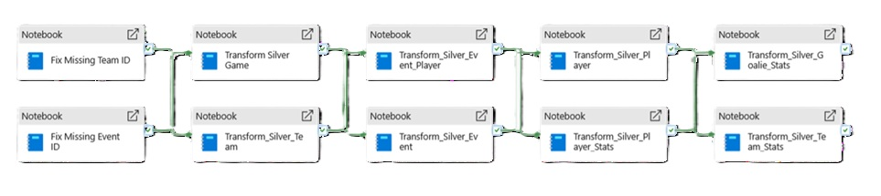

# NHL Game Analytics – Transforming Raw Hockey Data into Performance Intelligence  
### Project Overview

This project was completed as part of the Junior Data Engineer Programme final project. Using the NHL Game Dataset from Kaggle (20 years of data across 12 CSV files), we designed a scalable data pipeline and built a Power BI dashboard to turn raw match data into practical performance intelligence for hockey stakeholders. 

#### Premise
NHL organisers have collected match information over many years and wanted clearer, more usable insight from the dataset—especially in areas related to performance and trends. 

#### Objectives
- Design and implement a scalable ELT pipeline
- Develop an analytics-ready dimensional data model
- Deliver an interactive Power BI dashboard for insights 

#### Tech Stack
- Microsoft Fabric (Lakehouse using Delta Tables)
- PySpark (data transformation)
- Data Pipeline (orchestration)
- Power BI (dashboard + semantic model) 

#### Data Architecture (Medallion Approach)
**Bronze Layer**
- Ingested raw source data with no transformation to preserve fidelity
- Applied minimal processing for ingestion consistency
- Performed initial referential integrity checks on key identifiers  
  

**Silver Layer**
- Cleansed and standardized datasets for analytical consistency
- Removed duplicate/redundant records
- Normalized attributes to the right analytical granularity
- Applied formatting and enrichment rules
- Consolidated tables to better support downstream analytics  
  

**Gold Layer**
- Data Modeling (Semantic Model → Final ERD)  
    We started with an early semantic model where central fact tables connected event, player, goalie, and shift-related data, supported by dimensions for teams, games, players, and dates.
    After iterative refinement, we finalized a fact + dimension ERD optimized for reporting performance and clearer analytics. Insights and gaps were also documented to guide future improvements (e.g., pushing Power BI transformations upstream into Silver).   
  

#### Power BI Dashboard 
Design Principles
- Minimal clutter
- Consistent filters and slicers
- Built for coaches, analysts, and operations/strategy users 

#### Pages & Key Features
1) Overview
League standings using official NHL points rules:
Performance metrics normalized per 60 minutes of TOI (time on ice)   
  

2) Team Stats
Team-level performance metrics
Comparison of offensive output vs defensive pressure  
  

3) Skater Stats
Player performance normalized per 60 mins TOI
Scoring efficiency vs shot volume comparison  
  

4) Goalie Stats
Goalie metrics normalized per 60 mins ice time
Save efficiency vs defensive workload comparison  
  

5) League Trend
League-wide scoring, shot volume, and efficiency trends over time
Highlights shifts in play style and structural changes across eras   
  

#### Machine Learning Proof of Concept (Additional Exploration)
A small Machine Learning POC was tested to predict outcomes, where we observed:
Predicted probabilities clustered near 0 or 1 (model was confident distinguishing winners/losers)
Earlier low-probability issues were linked to large input scale, addressed through scaling considerations   
  

